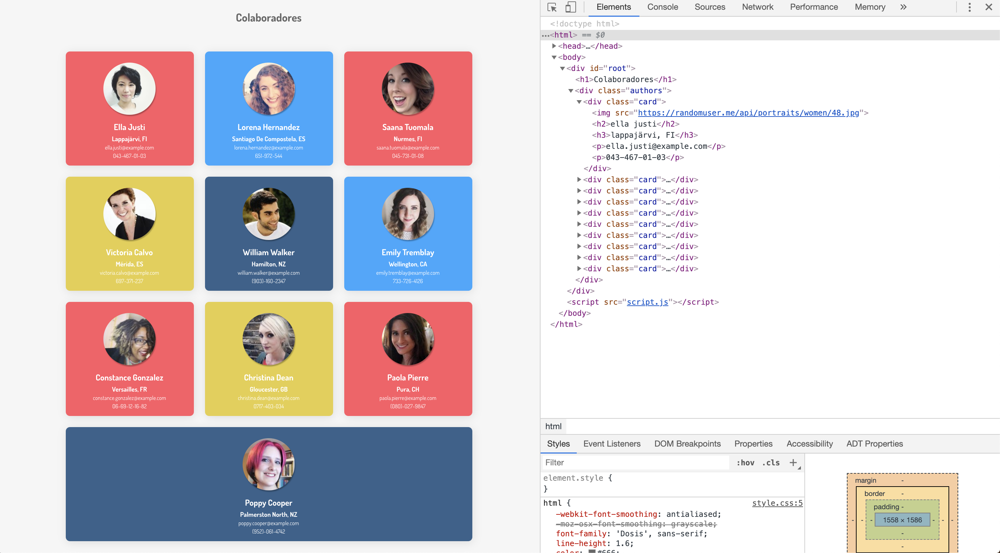

# Exercício
> Consumindo API - Página de colaboradore

Utilizar conceitos de manipulação do DOM e Objetos XMLHttpRequest para consumir os dados da API do [Random User Genarator](https://randomuser.me/)

**Usar template abaixo como referência de reultado final**

**Endpoint a ser utilizado**

https://randomuser.me/api/?results=10